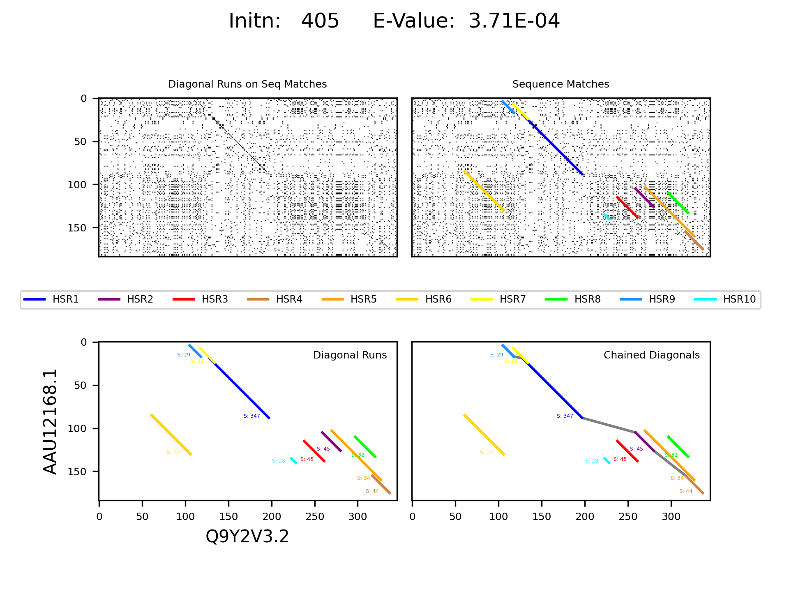

# SequenceAlignement
## Description
Comparing an unknown DNA, RNA, or amino acid sequence to a known sequence can yield insights into the potential function of the sequence. This project attempts to determine the similarity of genetic sequences in a reasonable amount of time using the FASTA sequence alignment algorithm. The FASTA algorithm implementation searches a personal database of sequences. It produces a ranking of the sequences in the database using the chained high-scoring diagonal runs generated by the two sequences. Though this paper suggests several improvements for this implementation, it was able to similarly rank sequences compared to the FASTA server implementation and the BLAST server implementation. The algorithm produces a visual inspection for each query and target pair providing additional indications of what the implementation considering.

This repository implements the FASTA Algorithm, formulated by David J. Lipman and William R. Pearson in 1985, in Python.

To import the relevant data for the sequences via an accession number open-source tools from [BioPython](https://biopython.org/) are used. Information from NCBI can be accessed via API using the Entrez package and calling the efetch function with the accession number and the database type. The efetch function returns an object reference to the accession number, which needs to is accessible via the read function in the SeqIO package. The read function returns accessible information about the accession number. This process is performed once for the query sequence outside the loop and for every accession number in the database list.

## Usage
Using the implementation to search a database subset

| Parameter                 | Default       | Description   |	
| :------------------------ |:------------- | :-----------------------------------------|
|-query                     | Required      | query accession number      
|-database_list             | Required      | target accession numbers list
|-type                      | 'Nucleotide'  | the type of sequence
|-k                         | 6             | K-tuple length              
|-diag_run_thres            | 50            | diagonal run score threshold
|-diag_allowed_gap          | 10            | the allowed gap between hotspots        
|-diag_gap_pen              | 2             | gap penalty for hotspot gaps
|-num_top_diags             | 10            | Number of diagonal Runs for Chaining  
|-chain_gap_pen             | 20            | Chaining gap penalty           

The accession numbers must be changed manually in run.py
### Defaults
```python
    query_acc = 'AAU12168.1'
    database_accs = ['P26367.2', 'Q1LZF1.1', 'P63016.1', 'P47238.1', 'P55864.1', 'P26630.1', 'O73917.1', 'P47237.1',
                     'G5EDS1.1', 'Q0IH87.2', 'P47239.2', 'P23760.2', 'P24610.2', 'O43316.1', 'P09082.1', 'O88436.1',
                     'P32115.2', 'Q645N4.1', 'P06601.1', 'P23759.4', 'O18381.3', 'Q90268.2', 'O57685.2', 'O57682.2',
                     'Q02962.4', 'P32114.2', 'Q02650.1', 'Q02548.1', 'Q00288.3', 'P09083.2', 'Q9YH95.1', 'P51974.2',
                     'Q06710.2', 'P47240.1', 'Q9PUK5.1', 'A0JMA6.2', 'Q5R9M8.1', 'Q28DP6.2', 'P47236.1', 'Q2VL57.1',
                     'Q2VL59.1', 'Q2VL61.1', 'Q2VL60.1', 'Q2VL58.1', 'Q2VL62.1', 'P55771.3', 'P23757.3', 'Q2L4T2.1',
                     'Q2VL51.1', 'P47242.1', 'Q2VL54.1', 'Q2VL50.1', 'P55166.1', 'Q2VL56.1', 'P09084.4', 'P15863.4',
                     'P23758.3', 'Q9PVX0.1', 'Q9PVY0.1', 'O42358.1', 'O42356.2', 'O42201.2', 'Q06453.2', 'O42567.2',
                     'Q9I9A2.1', 'Q9I9D5.1', 'O35602.2', 'O42357.1', 'Q9JLT7.1', 'O42115.1', 'Q9W2Q1.2', 'Q96IS3.1',
                     'A2T711.1', 'Q96QS3.1', 'A6YP92.1', 'Q9Y2V3.2', 'A6NNA5.1', 'Q8BYH0.2', 'Q7YRX0.1', 'O35085.3',
                     'Q91V10.1', 'Q9IAL2.1', 'O97039.1', 'Q62798.1', 'Q9GMA3.1', 'Q9NZR4.2', 'Q90277.1', 'Q4LAL6.1',
                     'Q94398.3', 'O42250.2', 'Q9H161.2', 'O35137.1', 'Q0P031.1', 'Q26657.2', 'O95076.2', 'O70137.1',
                     'Q1LVQ7.1', 'F1NEA7.2']
```
Lauch the run.py script to loop over the accession numbers.
```python
python run.py
```
## Results


